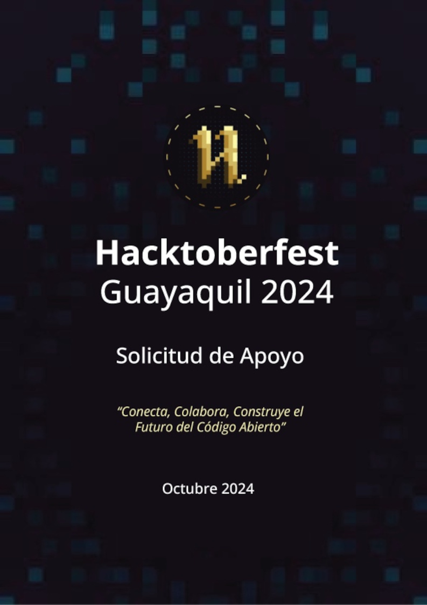
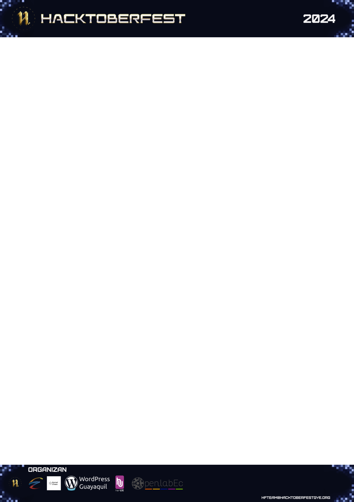

= Hacktoberfest 2024: Solicitud de Patrocinio
:front-cover-image: 
:page-background-image: 
:nofooter:

== ¿Qué es el Hacktoberfest?

{destinatario} +
{destinatario_institución}

{saludo},

El Hacktoberfest es un evento anual celebrado principalmente por las comunidades de software libre a nivel mundial. Se enfoca en promover el desarrollo, la colaboración entre programadores y contribuyentes de proyectos de software libre.

La idea surgió a partir de una campaña promovida por DigitalOcean, GitHub, y otros actores del ecosistema de código abierto en 2015. El evento originalmente se llamaba "Hacktoberfest" y se basaba en el Oktoberfest, una tradicional celebración alemana.

El día 19 de Octubre, se celebrará el Hacktoberfest 2024 Guayaquil, realizado por diversas comunidades de software y cultura libre en Guayaquil. Lograremos una convocatoria de a partir de 100 asistentes, en ese día único; además de los otros diversos eventos de acompañamiento para estas fechas, como el Día del Programador, 13 de septiembre, o al AWS Community Day y anunciamiento del Hacktoberfest, 5 de octubre.

=== ¿Cuáles son los objetivos?

.**Objetivos Generales**
1. **Promover el desarrollo de software libre**: Contribuir a fomentar la cultura de código abierto y la colaboración entre programadores en Guayaquil y alrededores.
2. **Fortalecer las comunidades de software y cultura libre**: Unir esfuerzos con otras comunidades para compartir conocimientos, herramientas y experiencias relevantes.
3. **Crear un evento inclusivo y atractivo**: Diseñar un programa que atraiga a al menos 100 asistentes y ofrezca una experiencia enriquecedora para todos los participantes.

.**Objetivos Específicos**
1. **Celebrar el Día del Programador (13 de septiembre)**: Organizar eventos previos relacionados con la programación y el software libre.
2. **Anunciar oficialmente el Hacktoberfest 2024 (5 de octubre)**: Realizar un evento inaugural que marque el comienzo de la celebración.
3. **Realizar el Hacktoberfest 2024 Guayaquil (19 de octubre)**: Organizar una actividad central que involucre a al menos 100 asistentes y ofrezca oportunidades para aprender, colaborar y disfrutar.

NOTE: En el 19 de Octubre, el Hacktoberfest, serán aplicados los paquetes de espónsores.

.**Consideraciones y Especificaciones**
1. **Ubicación**: El evento se llevará a cabo en Guayaquil, Ecuador.
2. **Fecha**: La celebración principal será el 19 de octubre de 2024.
3. **Asistentes**: Se espera una asistencia mínima de 100 personas.

=== ¿Quiénes somos?

Somos una coalición de comunidades de software y cultura libre. Nuestro objetivo en común es compartir las herramientas, conocimientos y otros procesos y procedimientos relevantes.

Las comunidades de software y cultura libre ofrecen oportunidades para aprender nuevas tecnologías, programación y otros conocimientos útiles. En estas comunidades, puedes encontrar a otras personas que compartan tus pasatiempos y entusiasmos. Además, puedes participar en proyectos de código abierto o contribuir a la creación de software y contenido bajo licencia libre.

== ¿Qué ofrecemos?

Aquí, encontrará una tabla que detalla los niveles de patrocinio disponibles:

[%autowidth.stretch,stripes=odd]
|===
|Nivel de Auspicio |Monto |Beneficios

|Diamante
|$450 o más
|Reconocimiento destacado como auspiciador principal al inicio, intermedios y final del evento. +
Logotipo de su organización en los materiales promocionales. +
Mención especial en nuestras redes sociales y sitio web. +
Un espacio tipo stand dentro de las instalaciones del Hacktoberfest +
Prioridad para postular un speaker dentro de los estatus del Hacktoberfest +
Acceso a la base de datos de profesionales, estudiantes, y otros relevantes, registrados o ponentes, del Hacktoberfest +
Oportunidad de colocar 2 RollUps y material publicitario.

|Oro
|$300
|Reconocimiento destacado como auspiciador principal al inicio y final del evento. +
Logotipo de su organización en los materiales promocionales. +
Mención en nuestras redes sociales y sitio web. +
Un espacio tipo stand dentro de las instalaciones del Hacktoberfest +
Oportunidad de colocar 1 RollUp y material publicitario.

|Plata
|$250
|Reconocimiento destacado como auspiciador principal al inicio y final del evento. +
Mención en nuestras redes sociales. +
Logotipo de su organización en los materiales promocionales. +
Oportunidad de colocar material publicitario.

|Bronce
|$100
|Reconocimiento como auspiciador en el evento. +
Logotipo de su organización en los materiales promocionales. +
Mención en nuestras redes sociales.
|===
